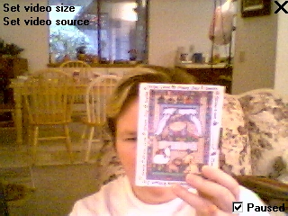



## Simple Video Capture

### Description

A simple video capture program, in only 44 lines of code. Now includes a button to change video size, and a button to change video source.

For a more complete implementation, go to Ray Mercer's site at www.shrinkwrapvb.com
 
### More Info
 

             |
---                |---
**Submitted On**   |2001-12-30 15:10:50
**By**             |[Kamilche](https://github.com/Planet-Source-Code/PSCIndex/blob/master/ByAuthor/kamilche.md)
**Level**          |Beginner
**User Rating**    |4.5 (36 globes from 8 users)
**Compatibility**  |VB 6\.0
**Category**       |[Miscellaneous](https://github.com/Planet-Source-Code/PSCIndex/blob/master/ByCategory/miscellaneous__1-1.md)
**World**          |[Visual Basic](https://github.com/Planet-Source-Code/PSCIndex/blob/master/ByWorld/visual-basic.md)
**Archive File**   |[Simple\_Vid4538712312001\.zip](https://github.com/Planet-Source-Code/kamilche-simple-video-capture__1-30036/archive/master.zip)

